# AWS Account Setup and IAM Configuration

This guide provides step-by-step instructions to create an AWS account, set up a billing alarm, create IAM groups and users, and test their permissions.

## Create a Billing Alarm

1. **Go to Billing and Management.**
   

2. **Select Budgets from the left sidebar.**
   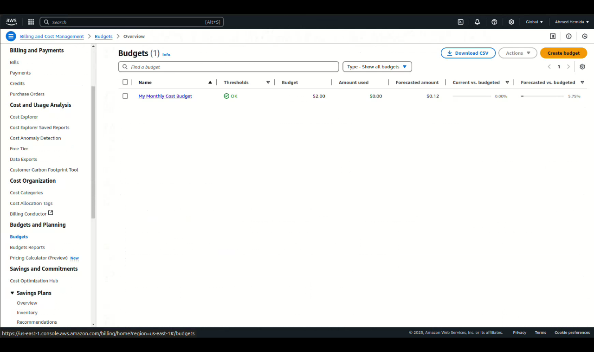

3. **Click on Create Budget.**
   

4. **Choose Budget Type.** Here, we will use the zero spend budget template that will notify us when we exceed the free tier limits.
   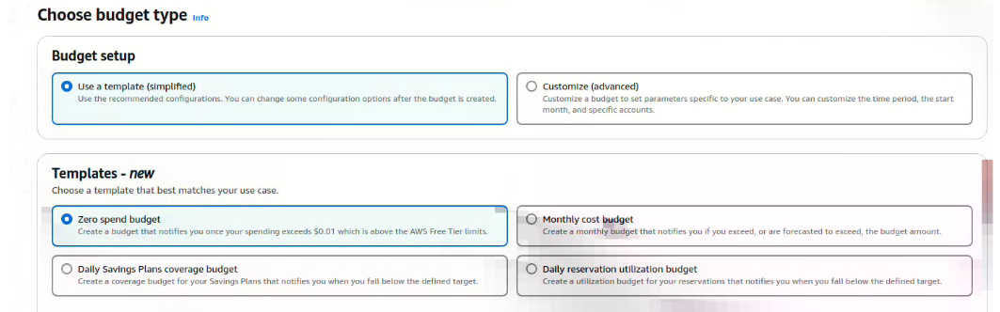

5. **Specify the budget template name and email recipients.**
   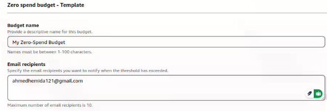

6. **You can now see the recently created budget.**
   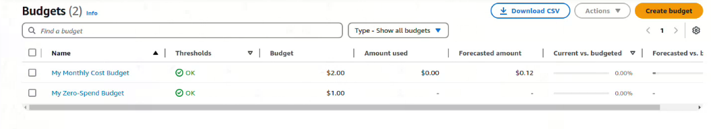

## Create Users and Groups

### Create 2 IAM Groups (admin, developer)

1. **Go to the IAM Dashboard.**
   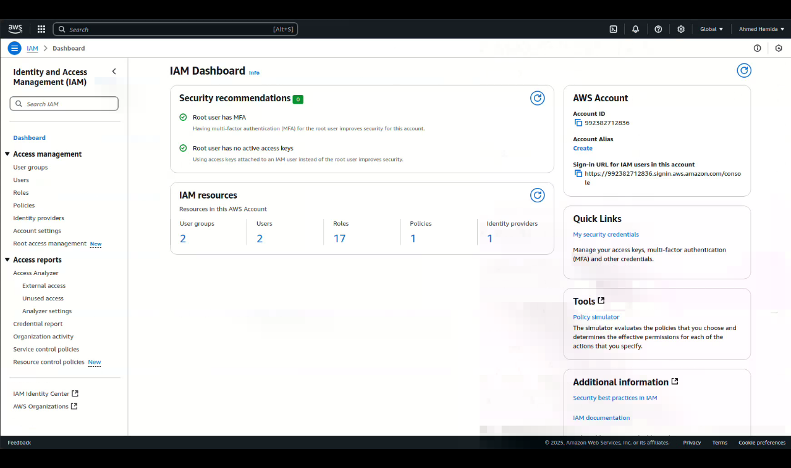

2. **Select User groups from the left sidebar.**
   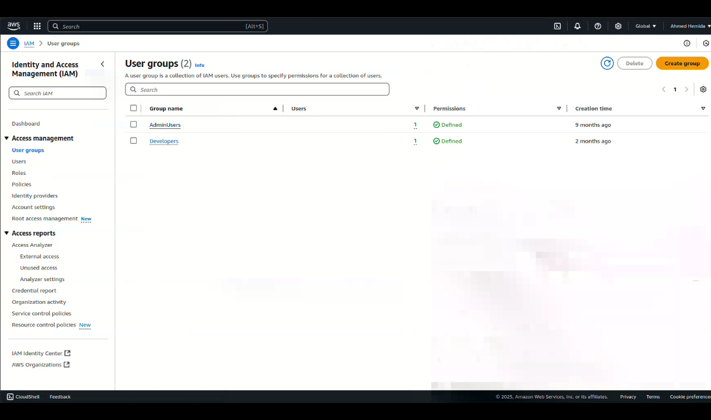

3. **Click on Create group.**
   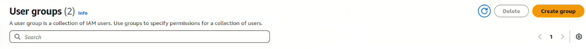

4. **Specify a name for the group, in our case, "admin".**
   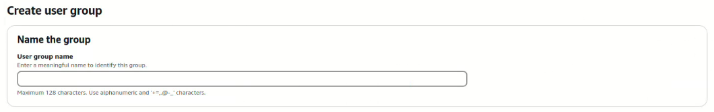

5. **Attach the Administrator policy to the group.**
   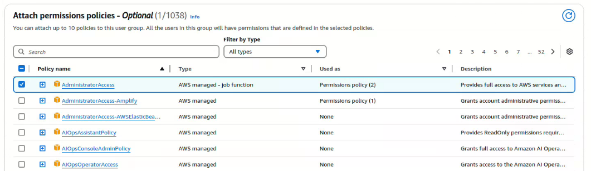

6. **Create another group named "developer".**
   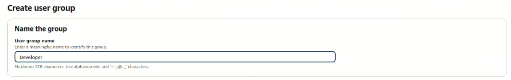

7. **Attach Permissions (EC2 Full Permissions) to the developer group.**
   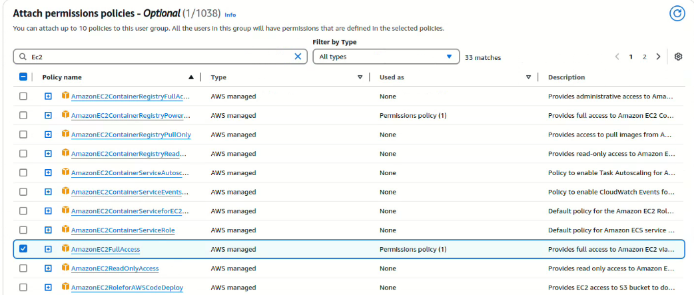

8. **Now we have 2 IAM groups: the Admin group with admin permissions and the Developer group with EC2 access.**
   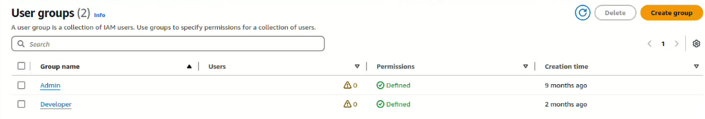
   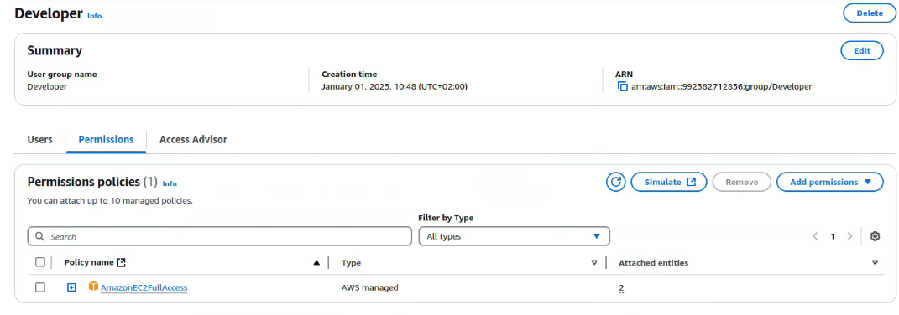

### Create 2 Users: admin-1 with console access only and MFA, and admin-2-prog with CLI access only

#### admin-1 Creation

1. **Go to the IAM Dashboard.**
   

2. **Select Users from the left sidebar.**
   

3. **Click on Create user.**
   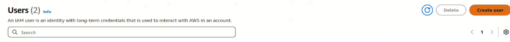

4. **Specify user details.** Ensure to select "Provide user access to the AWS Management Console" for the admin-1 user and "I want to create an IAM user".
   
   Then click Next.

5. **Set permissions.**
   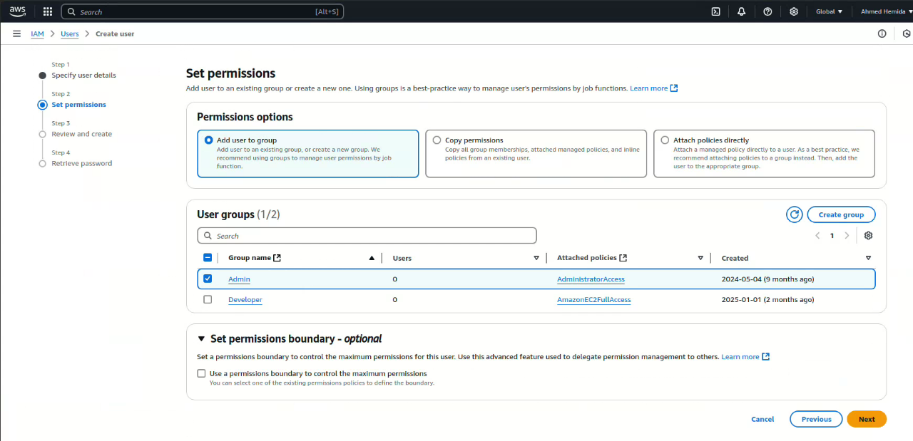

6. **Review your steps and click Create.**
   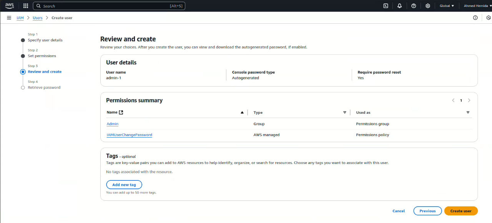

7. **After successfully creating the admin-1 user, save the user password for the next login.** Note: This password is for one-time use only and you will be required to change it upon the next login.
   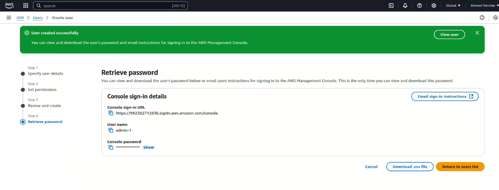

8. **admin-1 user summary.**
   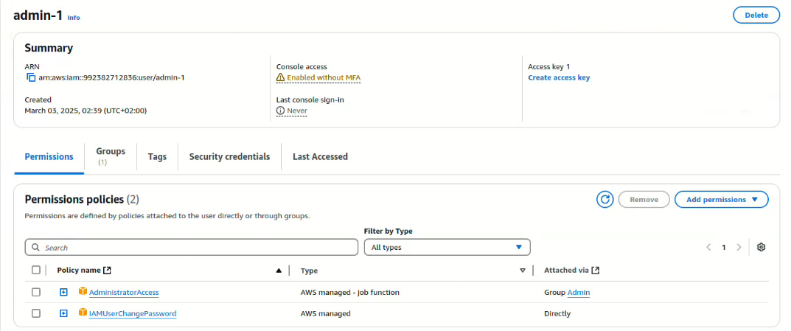

#### admin-1 Enable MFA

1. **In the admin-1 screen, go to Multi-factor authentication and choose Assign MFA device.**
   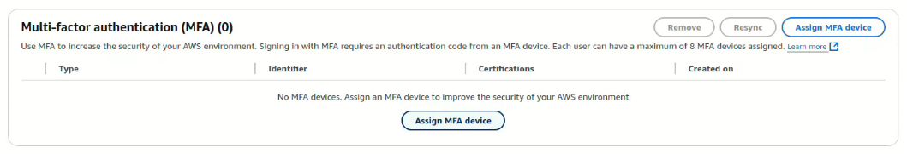

2. **Specify the MFA name and device option.**
   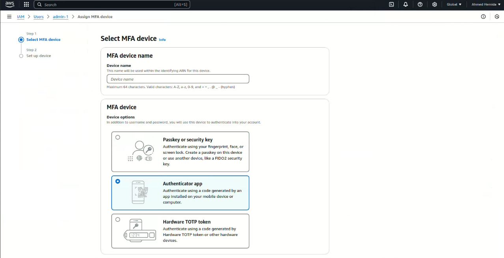

3. **Set up the device using any compatible application like Google Authenticator or Authy.** Scan the QR code and enter the codes from the application.
   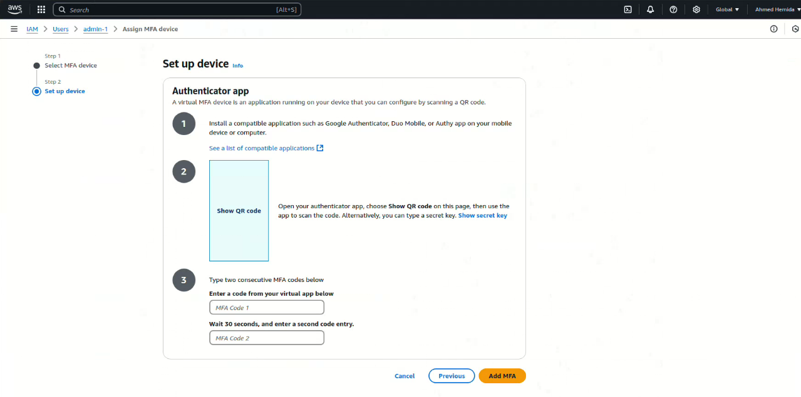

#### admin-2-prog Creation

1. **Select Users from the left sidebar.**
   

2. **Click on Create user.**
   

3. **Specify user details.** This time, do not select "Provide user access to the AWS Management Console" because we need CLI access only for admin-2-prog.
   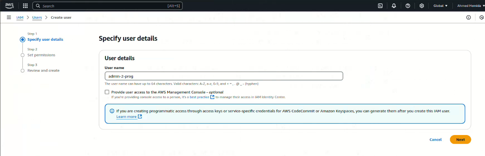

4. **Set permissions.**
   

5. **Review your steps and click Create.**
   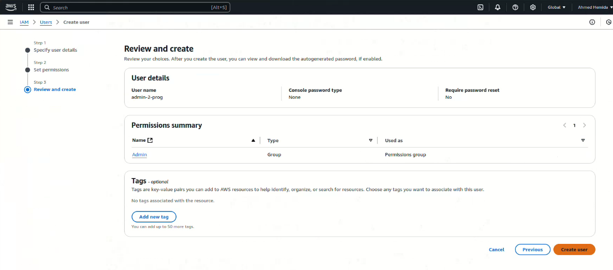

6. **Now we have created 2 groups with 2 admin users.**
   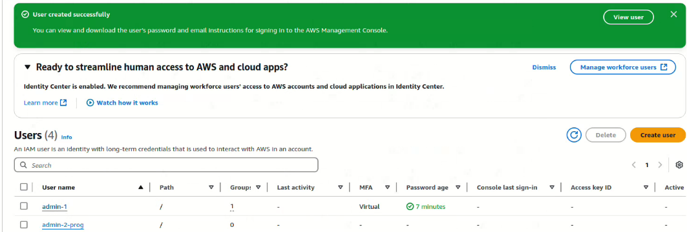

### Create Access Key for admin-2-prog

1. **Go to the admin-2-prog user details and create an access key.**
   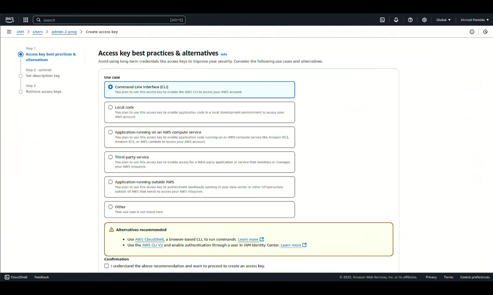

   **Don't forget to save your Access keys in a safe place.**

## Test admin-2-prog

1. **We need a machine with AWS CLI installed.**

2. **Configure your CLI with the newly created user:**
    ```sh
    aws configure --profile admin-2-prog
    ```
Or modify the credentials file:
    ```sh
    vi ~/.aws/credentials

    add
    [admin-2-prog]
    aws_access_key_id = YOUR_ACCESS_KEY_ID
    aws_secret_access_key = YOUR_SECRET_ACCESS_KEY
    ```

3. Verify the new configuration:
```sh
aws configure list-profiles
```
You will see the newly added user.

4. Test admin-2-prog user:
```sh
aws iam list-groups --profile=admin-2-prog
aws iam list-users --profile=admin-2-prog
```
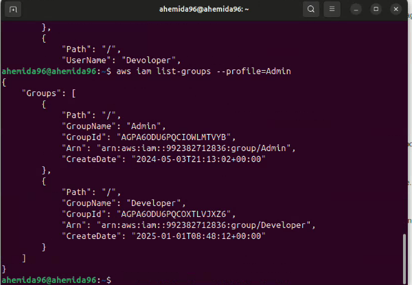
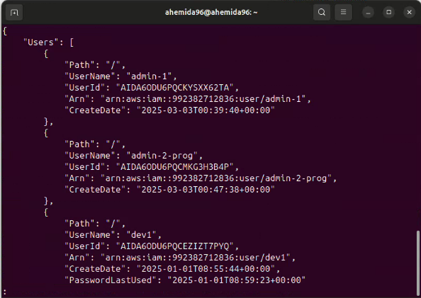

## Create dev-user with CLI and console access

1. Follow the admin-1 creation steps and change the required parameters:
    - Name: dev-user
    - Group: Developer

## Login to dev-user and test the assigned permissions

1. Go to the EC2 Dashboard and try to list and see the instances. You will see that you have permissions to use all EC2 features.

2. Go to the S3 Dashboard. You will get an Access Denied error due to lack of permissions.
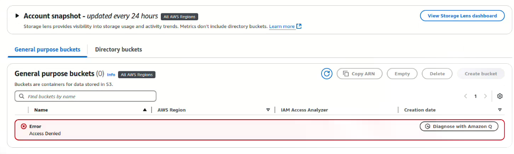

