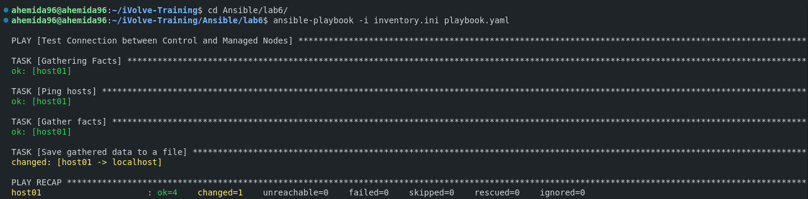

# Ansible Installation and Configuration Guide

This guide will help you install Ansible, configure it, and perform ad-hoc commands to check its functionality. We will also provide an example playbook and inventory file.

## Prerequisites

- A control node (your local machine)
- Managed nodes (remote machines you want to manage)
- SSH access to the managed nodes

## Step 1: Install Ansible

### On Ubuntu/Debian

```bash
sudo apt update
sudo apt install ansible -y
```

## Step 2: Configure Ansible

### Inventory File

Create an inventory file named `inventory.ini` with the following content:

```ini
[managed_nodes]
host01 ansible_host=192.168.74.135 ansible_user=ahemida96 ansible_ssh_private_key_file=/home/ahemida96/.ssh/id_rsa
```

### Playbook

Create a playbook file named `playbook.yaml` with the following content:

```yaml
---
- name: Test Connection between Control and Managed Nodes
    hosts: all
    tasks:
        - name: Ping hosts
            ping:

        - name: Gather facts
            setup:

        - name: Save gathered data to a file
            local_action: 
                module: copy
                content: "{{ ansible_facts | to_nice_json }}"
                dest: "host_facts_{{ inventory_hostname }}.json"
            delegate_to: localhost
```

## Step 3: Run Ad-Hoc Commands

### Ping Managed Nodes

To check the connectivity between the control node and the managed nodes, run:

```bash
ansible -i inventory.ini all -m ping
```

### Gather Facts

To gather facts about the managed nodes, run:

```bash
ansible -i inventory.ini all -m setup
```

## Step 4: Execute the Playbook

Run the playbook to test the connection and gather facts:

```bash
ansible-playbook -i inventory.ini playbook.yaml
```



## Explanation of the Playbook

- **Ping hosts**: This task uses the `ping` module to check the connectivity between the control node and the managed nodes.
- **Gather facts**: This task uses the `setup` module to gather facts about the managed nodes.
- **Save gathered data to a file**: This task saves the gathered facts to a JSON file on the control node.

## By following these steps, you will have Ansible installed and configured, and you will be able to perform basic ad-hoc commands and run a playbook to check the functionality.