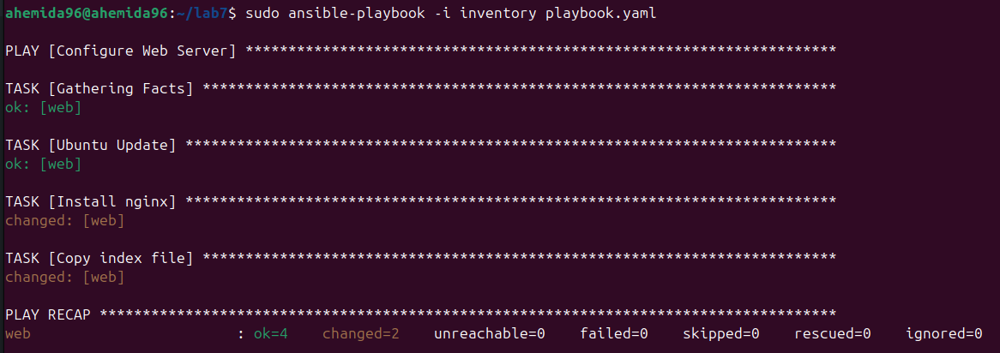
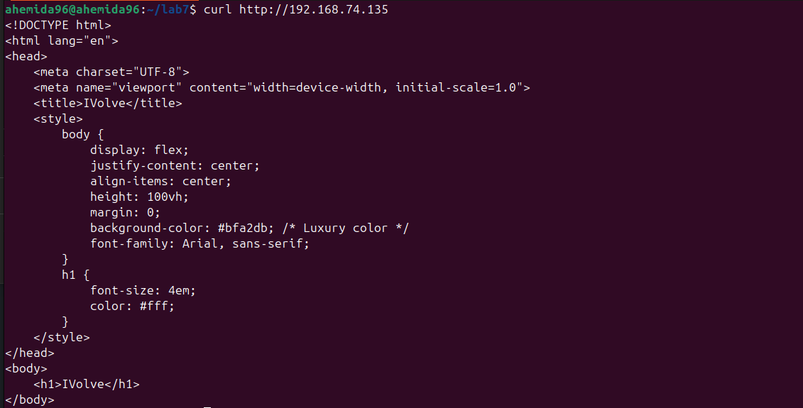

# Lab 7: Installing and Configuring Nginx with Ansible

This README provides instructions on how to install and configure Nginx using Ansible.

## Prerequisites

- Ansible installed on your control node.
- SSH access to the target nodes.

## Files in the Directory

- `playbook.yaml`: Ansible playbook to install and configure Nginx.
- `inventory`: Inventory file listing the target nodes.
- `index.html`: Custom HTML file to be served by Nginx.

## Steps

### 1. Create the Inventory File

Ensure that the `inventory` file contains the correct IP addresses and hostnames of the target nodes:

```ini
[managed_nodes]
web ansible_host=192.168.74.135 ansible_user=ahemida96 ansible_ssh_private_key_file=/path/to/your/private/file
```

### 2. Create the Config File for Ansible

```sh
[defaults]
inventory = inventory
become = true
become_method = sudo
become_user = root
become_ask_pass = false
```

### 3. Create the Playbook

The `playbook.yaml` file contain tasks to install Nginx, copy the `index.html` file, and start the Nginx service. Example:

```yaml
---
- name: Configure Web Server
  hosts: all
  become: true
  tasks:
    - name: "Ubuntu Update"
      apt:
        update_cache: yes
        cache_valid_time: 3600

    - name: "Install nginx"
      apt:
        name: ["nginx"]
        state: latest
        
    - name: "Copy index file"
      copy:
        src: index.html
        dest: /var/www/html/index.html
        mode: '0644'

  handlers:
    - name: "Start Nginx"
      service:
        name: nginx
        state: started
        enabled: true
```

### 3. Run the Playbook

Execute the playbook using the following command:

```sh
ansible-playbook -i inventory playbook.yaml
```



### 4. Verify the Installation

After the playbook runs successfully, verify that Nginx is installed and serving:

```
curl http://managed_node_ip
```
You should see the content of the `index.html` file.



### By following these steps, you have successfully installed and configured Nginx on your target nodes using Ansible.
