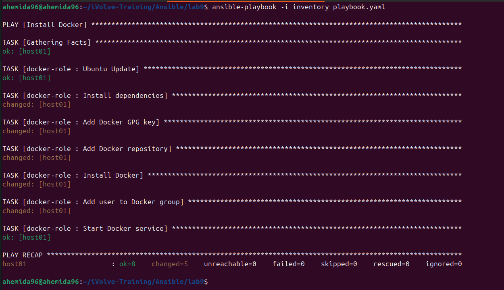
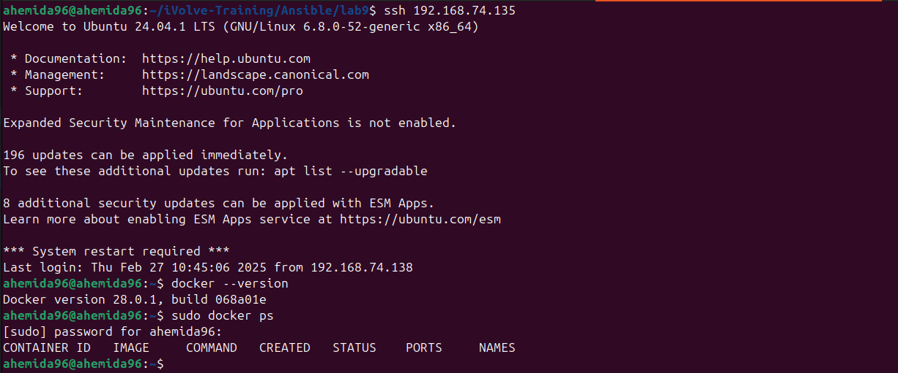
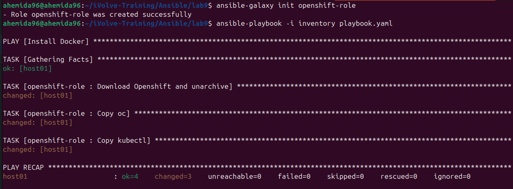
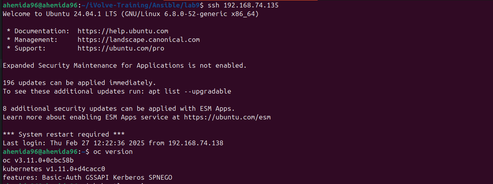
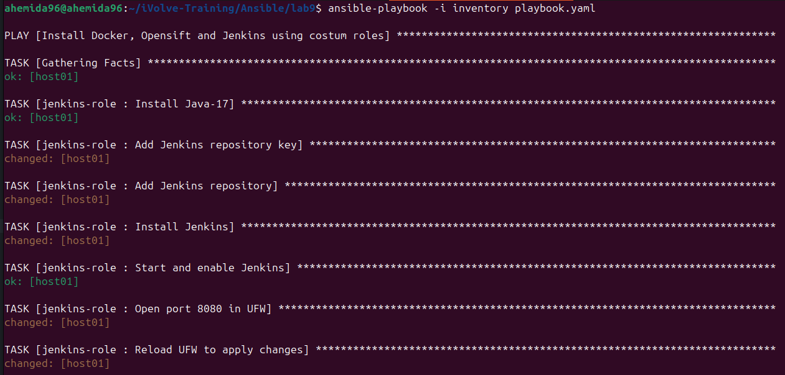
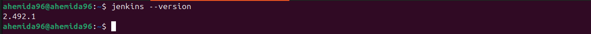

# Ansible Role for Docker, OpenShift, and Jenkins

This guide provides instructions on creating and using Ansible roles for Docker, OpenShift, and Jenkins. Follow the steps below to set up and use these roles.

## Step 1 - Create the Role Directory Structure

To create a role, start by generating its directory structure using the following command:

```sh
$ ansible-galaxy init <role_name>
```

This command creates a directory structure with subdirectories for tasks, handlers, files, templates, vars, defaults, and meta.

## Step 2 - Define Tasks

The main logic of the role is defined in the `tasks` directory. Create a `main.yml` file within this directory to list all tasks.

Example for installing Nginx:

```yaml
# roles/<role_name>/tasks/main.yml
---
- name: Install Nginx
    apt:
        name: nginx
        state: present
```

## Step 3 - Add Handlers

If there are services that need to be restarted or actions triggered by changes, define them in the `handlers` directory.

Example for restarting Nginx:

```yaml
# roles/<role_name>/handlers/main.yml
---
- name: Restart Nginx
    service:
        name: nginx
        state: restarted
```

## Using the Role

To use the role, include it in your playbook:

```yaml
---
- hosts: node2
    roles:
        - apache
```

## Verify for Syntax Errors

Check for syntax errors in your playbook:

```sh
ansible-playbook playbook-name.yml --syntax-check
```

## Run the Playbook

Execute the playbook with the following command:

```sh
ansible-playbook -i inventory playbook-name.yml
```

## Docker Role

Create a Docker role:

```sh
ansible-galaxy init docker-role
```

Define tasks for the Docker role:

```yaml
# roles/docker-role/tasks/main.yml
---
# tasks file for docker-role
- name: "Ubuntu Update"
    apt:
        update_cache: yes
        cache_valid_time: 3600

- name: Install dependencies
    apt:
        name: 
            - apt-transport-https
            - ca-certificates
            - curl
            - gnupg
            - lsb-release
        state: present
    
- name: Add Docker GPG key
    apt_key:
        url: https://download.docker.com/linux/ubuntu/gpg
        state: present

- name: Add Docker repository
    apt_repository:
        repo: deb [arch=amd64] https://download.docker.com/linux/ubuntu {{ ansible_distribution_release }} stable
        state: present

- name: Install Docker
    apt:
        name: docker-ce
        state: present

- name: Add user to Docker group
    user:
        name: "{{ ansible_user }}"
        groups: docker
        append: yes

- name: Start Docker service
    service:
        name: docker
        state: started
```

## OpenShift Role

Create an OpenShift role:

```sh
ansible-galaxy init openshift-role
```

Define tasks for the OpenShift role:

```yaml
# roles/openshift-role/tasks/main.yml
---
# tasks file for openshift-role

- name: Download Openshift and unarchive
    unarchive:
        src: https://github.com/openshift/origin/releases/download/v3.11.0/openshift-origin-client-tools-v3.11.0-0cbc58b-linux-64bit.tar.gz
        dest: /tmp/
        remote_src: yes

- name: Copy oc
    copy:
        src: /tmp/openshift-origin-client-tools-v3.11.0-0cbc58b-linux-64bit/oc
        dest: /usr/local/bin/oc
        mode: 0775
        remote_src: yes

- name: Copy kubectl
    copy:
        src: /tmp/openshift-origin-client-tools-v3.11.0-0cbc58b-linux-64bit/kubectl
        dest: /usr/local/bin/kubectl
        mode: 0775
        remote_src: yes
```

## Jenkins Role

Create a Jenkins role:

```sh
ansible-galaxy init jenkins-role
```

Define tasks for the Jenkins role:

```yaml
# roles/jenkins-role/tasks/main.yml
---
- name: Install Java-17
    ansible.builtin.apt:
        name: 
            - openjdk-17-jdk 
            - openjdk-17-jre
        state: present

- name: Add Jenkins repository key
    ansible.builtin.apt_key:
        url: https://pkg.jenkins.io/debian-stable/jenkins.io-2023.key
        state: present

- name: Add Jenkins repository
    ansible.builtin.apt_repository:
        repo: deb https://pkg.jenkins.io/debian-stable binary/
        state: present

- name: Install Jenkins
    ansible.builtin.apt:
        name: jenkins
        state: present
        update_cache: true

- name: Start and enable Jenkins
    ansible.builtin.service:
        name: jenkins
        state: started
        enabled: true

- name: Open port 8080 in UFW
    command: ufw allow 8080/tcp
    ignore_errors: true
    become: true

- name: Reload UFW to apply changes
    command: ufw reload
    ignore_errors: true
    become: true

- name: Store file into /tmp/fetched/host.example.com/tmp/somefile
    ansible.builtin.fetch:
        src: /var/lib/jenkins/secrets/initialAdminPassword
        dest: ./jenkins_initial_password
        flat: true

- name: Display Password Location
    ansible.builtin.debug:
        msg: "Password saved to ./jenkins_initial_password"
```

## Create a Playbook

Create a `playbook.yaml` to install Docker, OpenShift, and Jenkins using custom roles:

```yaml
---
- name: Install Docker, Openshift and Jenkins using custom roles
    hosts: all
    roles:
        - docker-role
        - openshift-role
        - jenkins-role
```

## Inventory

Define your inventory:

```ini
[managed_nodes]
host01 ansible_host=your_IP ansible_user=your_user ansible_ssh_private_key_file=/path/to/private/key
```

## Verify for Syntax Errors

Check for syntax errors in your playbook:

```sh
ansible-playbook playbook.yml --syntax-check
```

## Run the Playbook

Execute the playbook with the following command:

```sh
ansible-playbook -i inventory playbook.yml
```

## Docker




## OpenShift




## Jenkins



