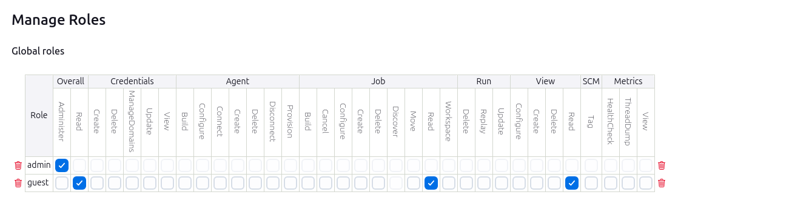
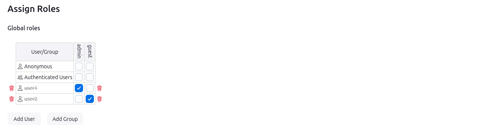

# Jenkins Role-Based Authorization

## Prerequisites
- Docker installed on your system

## Installing Jenkins as a Container

### Steps
1. **Pull Jenkins Docker Image:**
    ```sh
    docker pull jenkins/jenkins:lts
    ```

2. **Run Jenkins Container with persist Jenkins data:**
    ```sh
    docker run -d -p 8080:8080 -p 50000:50000 -v jenkins_home:/var/jenkins_home --name jenkins jenkins/jenkins:lts
    ```

3. **Access Jenkins:**
    Open your browser and go to `http://your_server_ip:8080`

## Create Role-Based Authorization

### Steps

1. **Install Role-Based Authorization Strategy Plugin:**
    - Go to `Manage Jenkins` -> `Manage Plugins`
    - Select the `Available` tab and search for `Role-based Authorization Strategy`
    - Install the plugin and restart Jenkins if required
    

2. **Configure Role-Based Authorization:**
    - Go to `Manage Jenkins` -> `Security`
    - Under `Authorization`, select `Role-Based Strategy` and save

3. **Create Roles:**
    - Go to `Manage Jenkins` -> `Manage and Assign Roles` -> `Manage Roles`
    - Under `Roles`, add a new role `admin` with all permissions checked
    - Add another role `read-only` with only read permissions checked
    

4. **Assign Roles to Users:**
    - Go to `Manage Jenkins` -> `Manage and Assign Roles` -> `Assign Roles`
    - Under `Global roles`, add `user1` and assign the `admin` role
    - Add `user2` and assign the `read-only` role
    

5. **Create Users:**
    - Go to `Manage Jenkins` -> `Manage Users`
    - Create `user1` and `user2` with their respective passwords

Now, `user1` will have admin privileges, and `user2` will have read-only access.
