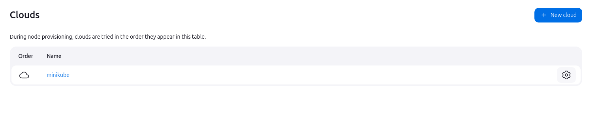
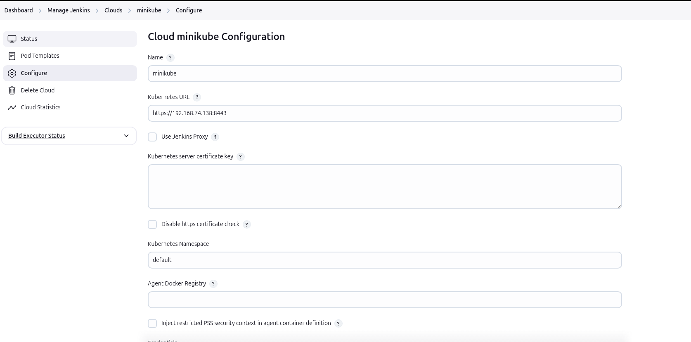
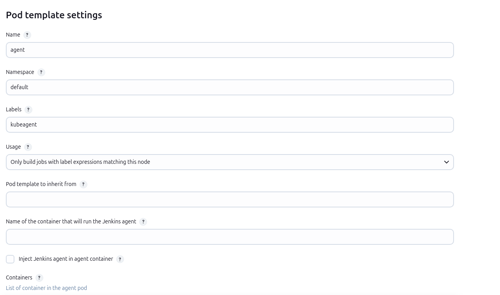

# Create and implement a Jenkins pipeline to automate the process of dockerizing a static application, pushing it to DockerHub Registry, and deploying it to a Minikube cluster.

## Prerequisites
1. **Jenkins Plugins**:  
   - Kubernetes plugin  
   - Docker plugin 
2. **Docker** installed on Jenkins.  
3. **Minikube** is running and accessible.  
4. **Credentials** are added to Jenkins:  
   - GitHub (`github-credentials`)  
   - DockerHub (`dockerhub-credentials`)  
   - Kubernetes (`kubeconfig`)

## Configure the connections between Jenkins and Minikube servers (VMs).
    1. Go to Manage Jenkins → Manage Plugins, install the `kubernetes` plugin.

    2. Go to Manage Jenkins → Manage Nodes and Clouds → Configure Clouds, click Add a new cloud → Kubernetes.
    

    3. Fill in the following details:
        - Name: minikube
        - Kubernetes URL: https://192.168.74.138:8443
        - Kubernetes Namespace: default
        - Jenkins URL: http://192.168.74.142:8080
        - Credentials: Add a new file secret credential with the config file. (~/.kube/config)
        

    4. In the same Kubernetes Cloud section:
        - Add a new Pod template.
        - Define a label (e.g., k8s-agent).
        
    
    5. Test the connection:
        

## Create a pipeline using Jenkinsfile

---

## 📌 **Pipeline Overview**
This pipeline performs the following key tasks:

1. **Clones** a GitHub repository.  
2. **Builds and tests** a Docker image.  
3. **Pushes** the Docker image to DockerHub.  
4. **Deploys** the application to a **Minikube Kubernetes cluster** using YAML manifests.  

---

## 🛠️ **Pipeline Breakdown**

### 1. **Pipeline Declaration**
```groovy
pipeline {
    agent any
```
- **`pipeline`** – Declares a scripted pipeline.  
- **`agent any`** – Runs on any available Jenkins agent.  

---

### 2. **Environment Variables**
```groovy
environment {
    BRANSH_NAME = 'Master'
    GITHUB_CREDENTIALS_ID = 'github-credentials'
    GITHUB_URL = 'https://github.com/Ahemida96/iVolve-Training.git'
    REGISTRY_USERNAME = "ahemida96"
    REGISTRY_CREDENTIALS_ID = 'dockerhub-credentials'
    IMAGE_NAME = 'webapp'
    K8S_DEPLOYMENT = 'Jenkins/lab3/k8s/webapp-deploy.yaml'
    K8S_SERVICE = 'Jenkins/lab3/k8s/webapp-service.yaml'
    K8S_CRED_ID = 'kubeconfig'
    MINIKUBE_SERVER = "https://192.168.74.138:8443"
}
```
- **Environment block** – Stores variables for reuse across the pipeline.  
- **BRANSH_NAME** – Git branch to clone (typo; should be `BRANCH_NAME`).  
- **GITHUB_CREDENTIALS_ID** – ID for GitHub credentials (stored in Jenkins).  
- **REGISTRY_USERNAME** – DockerHub username.  
- **IMAGE_NAME** – Docker image name.  
- **K8S_DEPLOYMENT** – Path to the Kubernetes deployment manifest.  
- **MINIKUBE_SERVER** – Minikube API server URL.  

---

### 3. **Stage 1: Clone Git**
```groovy
stage('Clone Git') {
    steps {
        git branch: BRANSH_NAME,
            credentialsId: GITHUB_CREDENTIALS_ID,
            url: GITHUB_URL
    }
}
```
- **Clones** the Git repository from **GITHUB_URL**.  
- Uses the **GITHUB_CREDENTIALS_ID** for authentication.  

---

### 4. **Stage 2: Build & Test Docker Image**
```groovy
stage("Build & Test Docker Image") {
    steps {
        script {
            sh 'ls'
            sh 'docker build -t ${REGISTRY_USERNAME}/${IMAGE_NAME}:${BUILD_ID} Jenkins/lab3/.'
        }
    }
}
```
- **Builds** a Docker image from the specified path.  
- Uses the **BUILD_ID** to tag the image.  
- **sh 'ls'** – Lists the directory to verify contents.  

---

### 5. **Stage 3: Push Docker Image**
```groovy
stage("Push Docker Image") {
    steps {
        withDockerRegistry([credentialsId: REGISTRY_CREDENTIALS_ID]) {
            sh 'docker push ${REGISTRY_USERNAME}/${IMAGE_NAME}:${BUILD_ID}'
        }
    }
}
```
- **withDockerRegistry** – Authenticates with DockerHub using credentials.  
- **Pushes** the Docker image to the DockerHub registry.  

---

### 6. **Stage 4: Deploy to Minikube**
```groovy
stage("Deploy to Minikube") {
    steps {
        withKubeConfig([credentialsId: K8S_CRED_ID, serverUrl: MINIKUBE_SERVER]) {
            sh 'kubectl apply -f ${K8S_DEPLOYMENT}'
            sh 'kubectl apply -f ${K8S_SERVICE}'
        }
    }
}
```
- **withKubeConfig** – Uses the Minikube cluster credentials to interact with Kubernetes.  
- **kubectl apply** – Deploys the application and service to the Minikube cluster.  

---

        