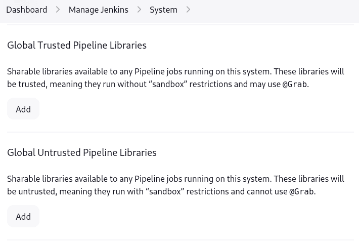
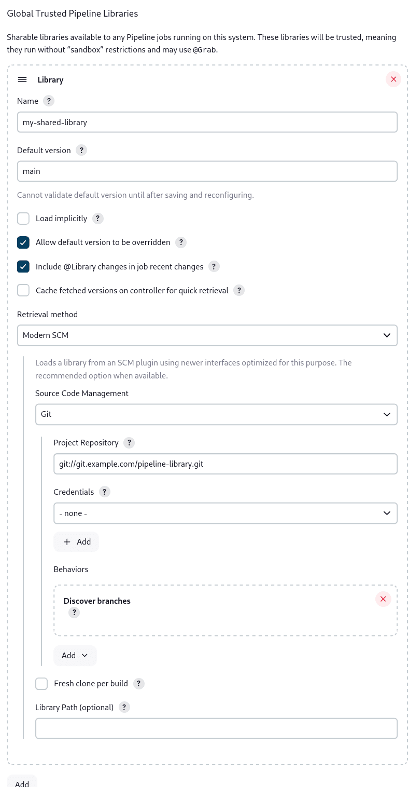

### Jenkins Slave & Shared Libraries

This guide will help you set up a Jenkins pipeline using a Jenkins slave and shared libraries. The pipeline will include stages for running unit tests, building the application, building a Docker image, pushing the image to a registry, removing the image locally, and deploying the application on Kubernetes.

#### Clone the Dockerfile
Clone the Dockerfile from the following repository:
```sh
git clone https://github.com/IbrahimAdell/App3.git
```

---

#### Create the Shared Library

2.1. **RunUnitTest** to test the Java application before building it.
```groovy
#!/usr/bin/env groovy

def call() {
    sh 'mvn test'
}
```

2.2. **BuildApp** to build our Java application.
```groovy
#!/usr/bin/env groovy

def call() {
    sh 'mvn clean package'
}
```

2.3. **BuildImage** to build the Docker image.
```groovy
#!/usr/bin/env groovy

def call(String image_name) {
    sh "docker build -t ${image_name}:${BUILD_ID} ."
}
```

2.4. **PushImage** to push the Docker image to a registry.
```groovy
#!/usr/bin/env groovy

def call(String image_name, String dockerHubCredentialsID) {
    withCredentials([usernamePassword(credentialsId: "${dockerHubCredentialsID}", usernameVariable: 'USERNAME', passwordVariable: 'PASSWORD')]) {
        sh "docker login -u ${USERNAME} -p ${PASSWORD}"
        sh "docker push ${USERNAME}/${image_name}:${BUILD_ID}"
    }
}
```

2.5. **RemoveImageLocally** to remove the Docker image locally.
```groovy
#!/usr/bin/env groovy

def call(String image_name) {
    sh "docker rmi ${image_name}:${BUILD_ID}"
}
```

2.6. **DeployOnK8s** to deploy the application on Kubernetes.
```groovy
#!/usr/bin/env groovy

def call(String image_name, String K8S_CRED_ID, String minikube_server, String deployment_file) {
    sh "sed -i 's|${image_name}:.*|${image_name}:${BUILD_ID}|g' ${deployment_file}"
    withCredentials([file(credentialsId: "${K8S_CRED_ID}", variable: 'KUBECONFIG')]) {
        sh "export KUBECONFIG=${KUBECONFIG} && kubectl --server ${minikube_server} --insecure-skip-tls-verify=true apply -f ${deployment_file}"
    }
}
```

#### You can find the full repo [Here]("https://github.com/Ahemida96/jenkins-shared-library.git").

---


### Create JenkinsFile

To use the Jenkins shared library in the Jenkinsfile, write:
```groovy
@Library('Your_library_name')_
```
**Note**: Use `_` at the end so Jenkins understands that the next will be the actual pipeline.

In the stages, call each function with its name you named the file with (e.g., `DockerProcess.groovy` -> `DockerProcess` is the name of the function).

```groovy
pipeline {
    agent any
    stages {
        stage('Run Unit Test') {
            steps {
                script {
                    RunUnitTest()
                }
            }
        }
        stage('Build App') {
            steps {
                script {
                    BuildApp()
                }
            }
        }
        stage('Build Image') {
            steps {
                script {
                    BuildImage(IMAGE_NAME)
                }
            }
        }
        stage('Push Image') {
            steps {
                script {
                    PushImage(IMAGE_NAME, REGISTRY_CREDENTIALS_ID)
                }
            }
        }
        stage('Remove Image Locally') {
            steps {
                script {
                    RemoveImageLocally(IMAGE_NAME)
                }
            }
        }
        stage('Deploy on K8s') {
            steps {
                script {
                    DeployOnK8s(IMAGE_NAME, K8S_CRED_ID, MINIKUBE_SERVER, K8S_DEPLOYMENT)
                }
            }
        }
    }
    post {
        success {
            echo "Pipeline completed successfully"
        }
        failure {
            echo "Pipeline failed"
        }
    }
}
```

---

### Configure Jenkins Slave

To configure a Jenkins slave to run the pipeline, follow these steps:
1. Go to **Manage Jenkins** > **Manage Nodes and Clouds** > **New Node**.
2. Enter the node name and select **Permanent Agent**.
3. Configure the node with the necessary details such as remote root directory, labels, and launch method.
4. Save the configuration and connect the node.

---

### Configure Jenkins to See the Shared Library
Go to **Manage Jenkins** > **System** > **Global Pipeline Libraries** and add your shared library configuration.





