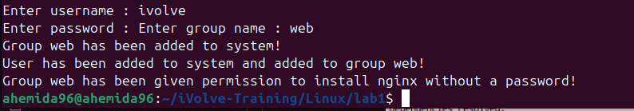
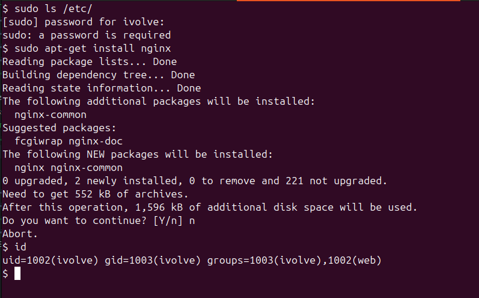

# User and Group Management Script

This script is used to create a new user, add the user to a specified group, and grant the group permission to install nginx without requiring a password.

## Prerequisites

- The script must be run as the root user.
- Perl installed on the system

## Usage

1. Save the script to a file, e.g., `script.sh`.
2. Make the script executable:
```sh
chmod +x script.sh
```
3. Run the script
```sh
sudo ./script.sh
```



## Script Explanation

### Script Overview
The script performs the following tasks:

1. Prompts for a username, password, and group name.
2. Checks if the username already exists.
3. Checks if the group name already exists; if not, creates the group.
4. Creates the user with the specified password and adds the user to the specified group.
5. Grants the group permission to install nginx without requiring a password by adding an entry to the sudoers.d directory.

### Script Details
```sh
#!/bin/bash

apt-get install perl -y

if [ $(id -u) -eq 0 ]; then
    read -p "Enter username : " username
    read -s -p "Enter password : " password
    read -p "Enter group name : " groupname
    egrep "^$username" /etc/passwd >/dev/null
    if [ $? -eq 0 ]; then
        echo "$username exists!"
        exit 1
    else
        egrep "^$groupname" /etc/group >/dev/null
        if [ $? -ne 0 ]; then
            groupadd "$groupname"
            [ $? -eq 0 ] && echo "Group $groupname has been added to system!" || echo "Failed to add group!"
        fi
        pass=$(perl -e 'print crypt($ARGV[0], "password")' $password)
        useradd -m -p "$pass" -G "$groupname" "$username"
        [ $? -eq 0 ] && echo "User has been added to system and added to group $groupname!" || echo "Failed to add a user!"
        echo "%$groupname ALL=(ALL) NOPASSWD: /usr/bin/apt-get install nginx" > /etc/sudoers.d/$groupname
        [ $? -eq 0 ] && echo "Group $groupname has been given permission to install nginx without a password!" || echo "Failed to update sudoers file!"
    fi
else
    echo "Only root may add a user to the system."
    exit 2
fi
```

### Commands Explanation

- id -u: Checks the user ID of the current user.
- read -p: Prompts the user for input.
- egrep "^$username" /etc/passwd: Checks if the username already exists.
- groupadd "$groupname": Creates a new group.
- perl -e 'print crypt($ARGV[0], "password")' $password: Encrypts the password.
- useradd -m -p "$pass" -G "$groupname" "$username": Creates a new user and adds the user to the specified group.
- echo "%$groupname ALL=(ALL) NOPASSWD: /usr/bin/apt-get install nginx" > /etc/sudoers.d/$groupname: Grants the group permission - to install nginx without requiring a password.

