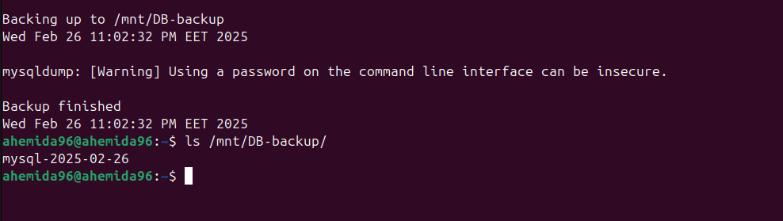

# MySQL Installation and Backup on Ubuntu

## Installation

To install MySQL on Ubuntu, follow these steps:

1. **Update the package index:**
    ```sh
    sudo apt update
    ```

2. **Install MySQL server:**
    ```sh
    sudo apt install mysql-server
    ```

3. **Secure MySQL installation:**
    ```sh
    sudo mysql_secure_installation
    ```

4. **Start MySQL service:**
    ```sh
    sudo systemctl start mysql
    ```

5. **Enable MySQL to start on boot:**
    ```sh
    sudo systemctl enable mysql
    ```

## Backup

To take a backup of your MySQL databases, you can use the `Backup_script.sh` file. Follow these steps:

1. **Create the backup script:**
    ```sh
    nano Backup_script.sh
    ```

2. **Add the following content to `Backup_script.sh`:**
    ```sh
    #!/bin/bash

    # Where to backup to.
    [ ! -d backup_location ] && mkdir $backup_location
    backup_location="path/to/backup/location"

    # Print start status message.
    echo "Backing up to $backup_location"
    date
    echo

    day=$(date +%F)
    mysqldump -u [username] -p[password] --all-databases > "$backup_location-mysql-$day"

    # Print end status message.
    echo
    echo "Backup finished"
    date

    ```

    Replace `[username]` and `[password]` with your MySQL username and password, and `/path/to/backup/` with the desired backup directory.

3. **Make the script executable:**
    ```sh
    chmod +x Backup_script.sh
    ```

4. **Schedule the backup script using crontab:**
    ```sh
    crontab -e
    ```

5. **Add the following line to schedule the script to run at 5:00 AM every Sunday:**
    ```sh
    0 5 * * 0 /home/ahemida96/iVolve-Training/Linux/lab2/Backup_script.sh
    ```

    
## Summary

- **Install MySQL:** `sudo apt install mysql-server`
- **Start MySQL:** `sudo systemctl start mysql`
- **Backup Script:** Create `Backup_script.sh` and make it executable
- **Schedule Backup:** Add to crontab with `0 5 * * 0` schedule
