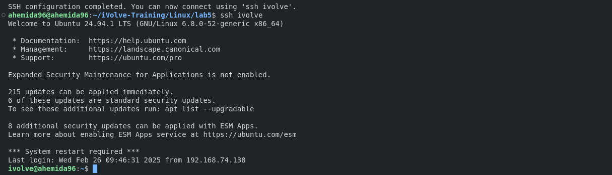

# SSH Configuration Script

This README provides step-by-step instructions and commands to create an SSH configuration using a script.

## Script Overview

The script performs the following tasks:
1. Generates SSH keys (commented out by default).
2. Copies the public key to the remote VM.
3. Configures SSH to use an alias for easier connection.

## Script

```bash
#!/bin/bash

# Variables
REMOTE_USER="ivolve"
REMOTE_HOST="192.168.74.135"
ALIAS_NAME="ivolve"
SSH_DIR="$HOME/.ssh"
CONFIG_FILE="$SSH_DIR/config"

# Generate SSH keys
# ssh-keygen -t rsa -b 2048 -f "$SSH_DIR/id_rsa" -N ""

# Copy the public key to the remote VM
ssh-copy-id -i "$SSH_DIR/id_rsa.pub" "$REMOTE_USER@$REMOTE_HOST"

# Configure SSH to use the alias
{
    echo "Host $ALIAS_NAME"
    echo "    HostName $REMOTE_HOST"
    echo "    User $REMOTE_USER"
    echo "    IdentityFile $SSH_DIR/id_rsa"
} >> "$CONFIG_FILE"

echo "SSH configuration completed. You can now connect using 'ssh $ALIAS_NAME'."
```

## Steps to Execute the Script

1. **Generate SSH Keys (Optional)**:
   Uncomment the `ssh-keygen` line in the script if you need to generate new SSH keys.
   ```bash
   ssh-keygen -t rsa -b 2048 -f "$HOME/.ssh/id_rsa" -N ""
   ```

2. **Run the Script**:
   Save the script to a file, for example `setup_ssh.sh`, and make it executable:
   ```bash
   chmod +x setup_ssh.sh
   ```

3. **Execute the Script**:
   Run the script to set up the SSH configuration:
   ```bash
   ./setup_ssh.sh
   ```

4. **Connect Using the Alias**:
   After the script completes, you can connect to the remote host using the alias:
   ```bash
   ssh ivolve
   ```




## Notes

- Ensure that the SSH directory (`~/.ssh`) exists and has the correct permissions.
- The script assumes that the SSH keys are named `id_rsa` and `id_rsa.pub`. Adjust the script if your keys have different names.
