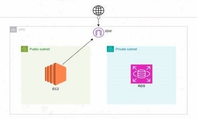
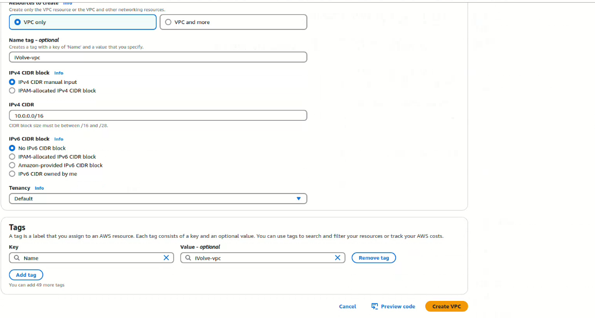
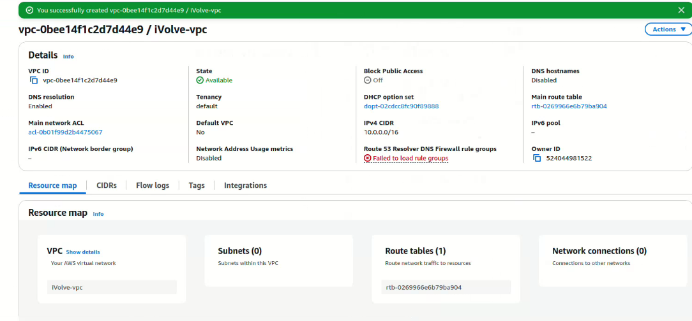
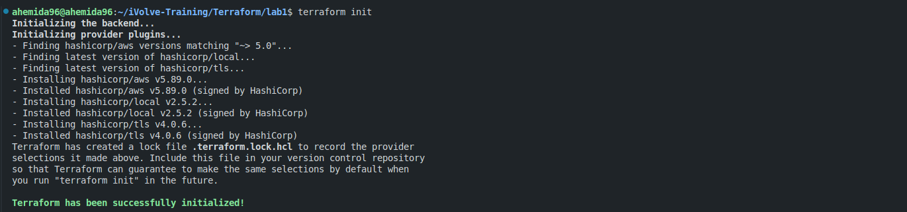
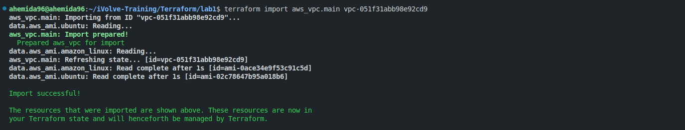
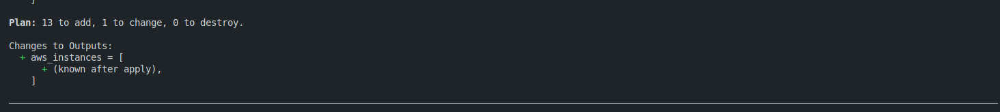
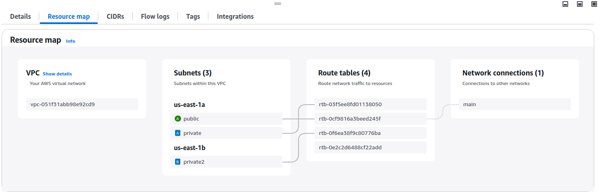
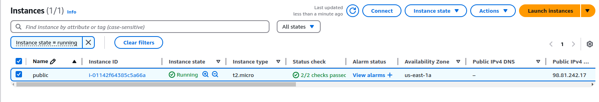
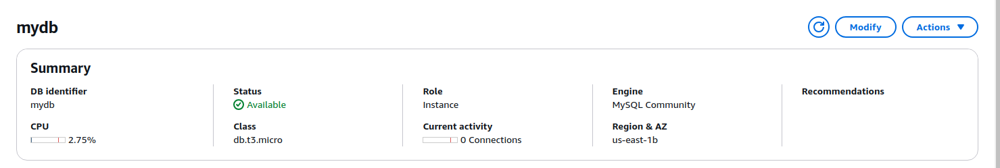
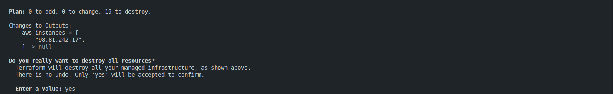

# Multi-Tier Application Deployment with Terraform




## Task
- Create a VPC manually in AWS.
- Make Terraform manage this VPC.
- Use Terraform to define and deploy a multi-tier architecture including 2 subnets, EC2, and RDS database.
- Use local provisioner to write the EC2 IP in a file called ec2-ip.txt.

## Prerequisits
- terraform installed
- aws cli configured
- hashicorp/aws

## Steps

1. Create VPC manually
    1. Go to VPC Dashborad and select create VPC
    

    2. Save the VPC-ID, we will use use it in the next step
    

2. Initialize the terraform project
    ```sh
    terraform init
    ```
    

3. Import the manually created VPC into our project
    ```sh
    terraform import aws_vpc.main vpc-id
    ```
    

4. Now you can start provisioning the infrastructure
    1. Make sure everything is okay by running:
    ```sh
    terraform init
    ```
    Once You saw this, you are ready to go.
    

    2. Apply the changes
    ```sh
    terraform apply
    ```
    ### Results

    
    
    

5. After finishing we need to clean to prevent any additional cost
    ```sh
    terraform destroy
    ```
    