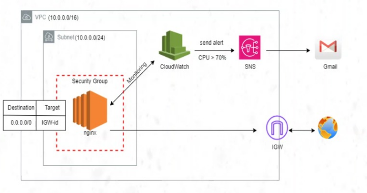
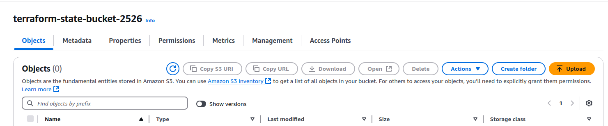
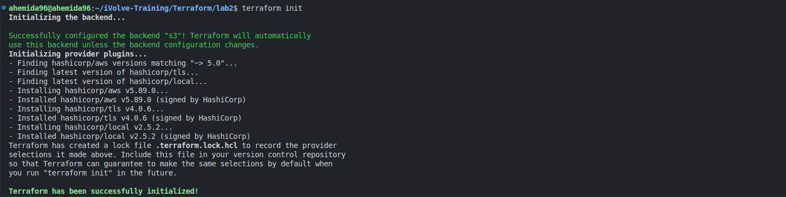
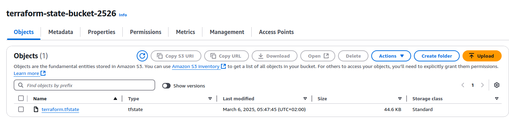
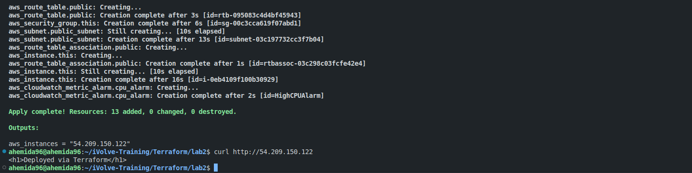
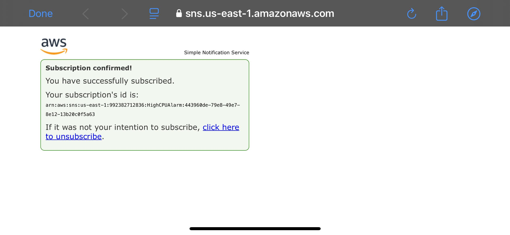
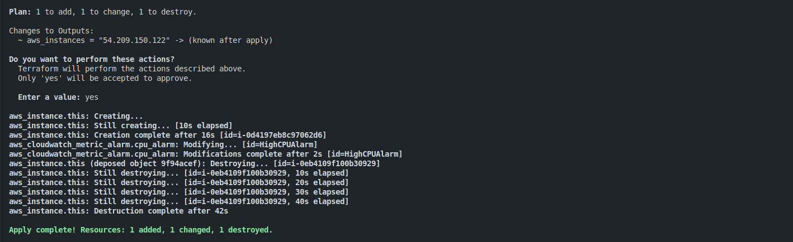
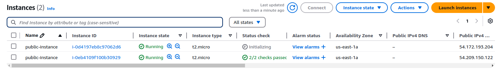
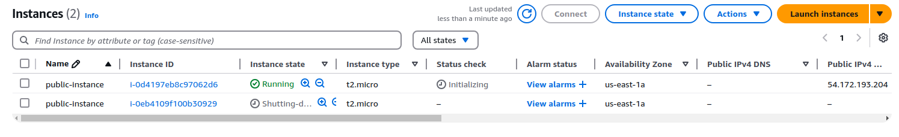

# Terraform Project: Multi-Tier Architecture with Nginx Installation



## Task Requirements
- Implement the below diagram with Terraform
- Install Nginx using user data
- Store state file in a remote backend S3
- Use `create_before_destroy` lifecycle on EC2 and verify it
- Compare between different lifecycle rules

## Diagram Description
- VPC with CIDR `10.0.0.0/16`
- Public subnet inside the VPC with CIDR `10.0.0.0/16`
- EC2 instance inside the public subnet with a security group
- Internet gateway connected to the subnet via a route table
- CloudWatch to monitor CPU usage
- If CPU usage exceeds 70%, an alarm will be triggered to send an email using SNS

## Steps

1. Create the VPC
2. Create the Subnet
3. Create the Internet Gateway and Route Table
4. Create the Security Group
5. Create the EC2 Instance with User Data
6. Create CloudWatch Alarm and SNS Topic
7. Store State File in Remote Backend S3
8. Verify `create_before_destroy` Lifecycle rule ensures that a new resource is created before the old one is destroyed.


## Usage steps

1. Create S3 bucket to store the state file
```bash
bash setup-s3.sh
```


2. Initialize Terraform
```bash
terraform init
```


3. Verify everything is ok
```bash
terraform plan
```


4. Apply the changes
```bash
terraform apply
```




5. Verify Create_before_destroy lifecycle by changing in the ec2 configurations





6. Clean up to prevent any additional cost
```bash
terraform destroy
```

## Compare Different Lifecycle Rules

- `create_before_destroy`: Ensures new resource is created before the old one is destroyed.
- `prevent_destroy`: Prevents the resource from being destroyed.
- `ignore_changes`: Ignores changes to specified attributes.