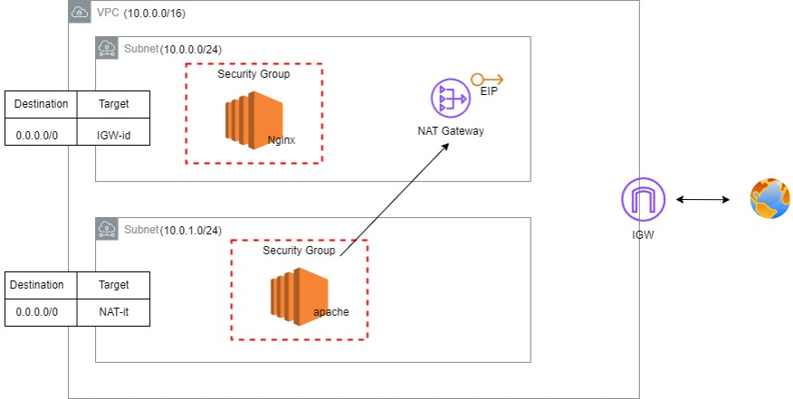

# Terraform AWS VPC with Public & Private Subnets

## Description

This repository contains a Terraform configuration that provisions a complete AWS networking environment, including a VPC, public and private subnets, NAT and Internet gateways, route tables, security groups, and EC2 instances. The configuration demonstrates how to set up a basic, secure AWS infrastructure that distinguishes between public and private resources.


## Features

- **VPC Creation**: Establishes a dedicated Virtual Private Cloud (VPC) with a defined CIDR block.
- **Subnet Provisioning**:
  - **Public Subnet**: Hosts an EC2 instance that is directly accessible from the internet.
  - **Private Subnet**: Hosts an EC2 instance that accesses the internet via a NAT Gateway.
- **Gateways & Routing**:
  - **Internet Gateway**: Provides internet connectivity to the VPC.
  - **NAT Gateway**: Enables outbound internet traffic for resources in the private subnet.
  - **Route Tables**: Configure routes for both public and private subnets.
- **Security Groups**: 
  - Public and private security groups that allow HTTP (port 80) and SSH (port 22) traffic.
- **EC2 Instances**:
  - A **public EC2 instance** located in the public subnet.
  - A **private EC2 instance** located in the private subnet, configured with user data to install and start a web server.

## Prerequisites

- [Terraform](https://www.terraform.io/downloads.html) (v0.12 or later recommended)
- An active [AWS account](https://aws.amazon.com/free/) with the necessary permissions
- AWS CLI (optional, for additional verification and management)
- A key pair named `terraform` must exist in your AWS account (or update the key name in the configuration accordingly).

## Getting Started

Follow these steps to deploy the infrastructure using Terraform.

### 1. Clone the Repository

```bash
git clone https://github.com/Ahemida96/Terraform-AWS-VPC-with-Public-Private-Subnets-and-EC2.git
cd Terraform-AWS-VPC-with-Public-Private-Subnets-and-EC2
```
### 2. Configure AWS Credentials
```bash
export AWS_ACCESS_KEY_ID=your_access_key_id
export AWS_SECRET_ACCESS_KEY=your_secret_access_key
export AWS_DEFAULT_REGION=us-west-2  # or your preferred region
```
Alternatively, use the AWS CLI:
```
aws configure
```
### 3. Initialize Terraform
```bash
terraform init
```
### 4. Review the Execution Plan
```bash
terraform plan
```
### 5. Apply the Terraform Configuration
```bash
terraform apply
```
### 6. Verify Deployment
After a successful deployment, you can log in to your AWS Console to inspect the created resources, including the VPC, subnets, gateways, security groups, and EC2 instances.
### 7. Clean Up Resources
When you are done, destroy the resources to avoid unnecessary charges:
```bash
terraform destroy
```
Confirm by typing **yes** when prompted.

## Customization
- AWS Provider: The AWS provider block is currently commented out. Uncomment and modify the region if necessary.
- AMI IDs: The AMI IDs used in the EC2 instance resources may need to be updated to reflect the current, valid AMIs in your region.
- Key Pair: Ensure that the key pair (terraform) exists in your AWS account, or update the key name in the configuration.
- Availability Zones: The availability_zone fields in the subnet configurations are commented out. You may uncomment and specify them based on your deployment needs.
