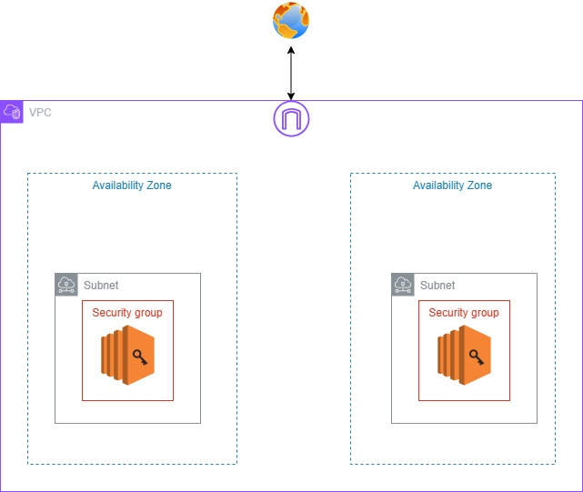

# TERRAFORM with Amazon Web Serives

<p align="center">
  
  
</p>


## Overview
This Terraform project builds a public subnets. Public EC2 instances run NGINX in existing Virtual Private Cloud (VPC).

---

## Architecture
### Architecture Diagram


The architecture includes:
- **VPC with Two Availability Zones (AZs):**
  - Each AZ has a public subnet.
  - 2 Public subnets are connected to an Internet Gateway (IGW).

- **EC2 Instances:**
  - **Public Instances:** Run NGINX Web Servers

---

## Post-Deployment Steps
### Verify NGINX and Apache Configuration
1. Connect to the public EC2 instances using SSH.
```bash
ssh -i <path-to-private-key> ubuntu@<public-ec2-ip>
```
2. Check that NGINX is running and configured.
```bash
sudo systemctl status nginx
```

---


## Usage

To deploy the Terraform configuration from the **Day-3** branch, follow these steps:

1. **Checkout the Day-3 branch and pull the latest changes:**
    ```sh
    git clone https://github.com/Ahemida96/Terraform-with-Network-Load-Balancer-Application.git
    cd Terraform-with-Network-Load-Balancer-Application
    ```

2. **Initialize Terraform:**
    ```sh
    terraform init
    ```

3. **Apply the Terraform configuration:**
    ```sh
    terraform apply
    ```

---

## Conclusion
This project demonstrates a complete AWS VPC setup with multi-AZ architecture, ALBs, and instance configuration for scalable and secure application deployment. The Terraform configuration ensures an automated, modular infrastructure as code solution for cloud-based applications.
