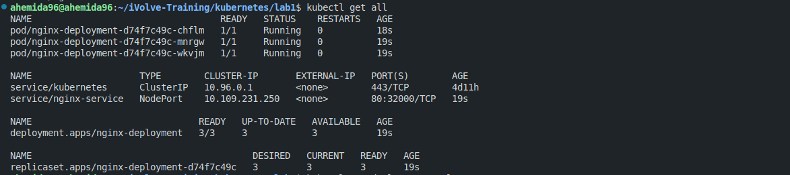
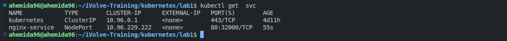
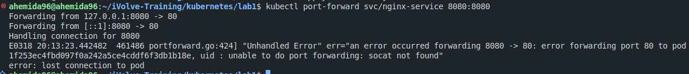
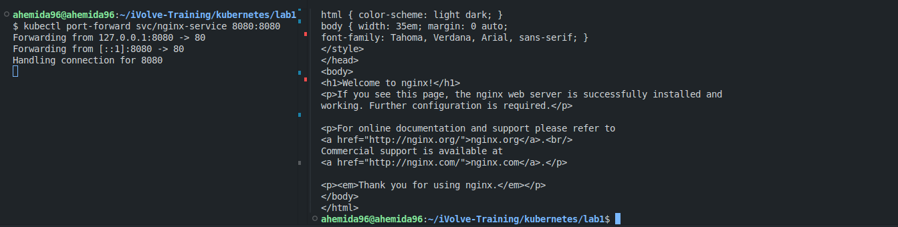
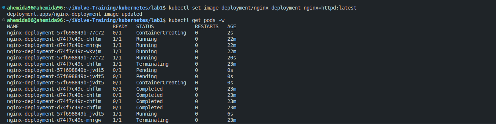
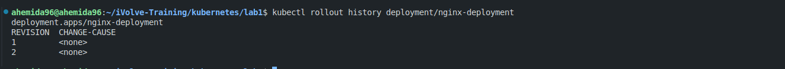
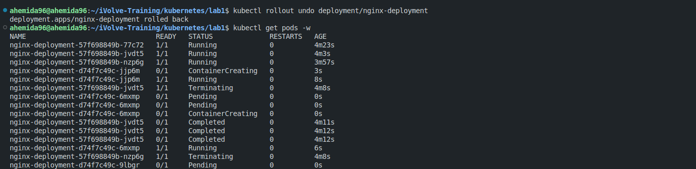

# Updating Applications and Rolling Back Changes in Kubernetes

Deploying an NGINX application, updating it to Apache, and rolling back to the previous version.

## Prerequisites
- Kubernetes cluster setup
- `kubectl` installed and configured

## Steps

### 1. Deploy NGINX with 3 Replicas

Create a deployment for NGINX with 3 replicas using the provided `deployment.yaml` file.

```bash
kubectl apply -f deployment.yaml
```




### 2. Create a Service to Expose NGINX Deployment

Expose the NGINX deployment using the provided `service.yaml` file.

```bash
kubectl apply -f service.yaml
```


### 3. Use Port Forwarding to Access NGINX Service Locally

Forward a local port to the NGINX service to access it locally.

```bash
kubectl port-forward svc/nginx-service 8080:80
```

If you got this error below, you can simply download the required utility.


```sh
sudo apt-get update
sudo apt-get install socat
```

You can now access NGINX at `http://localhost:8080`.


### 4. Update NGINX Image to Apache

Update the deployment to use the Apache image instead of NGINX.

```bash
kubectl set image deployment/nginx-deployment nginx=httpd:latest
```

Run the following to see the replacement porcess
```sh
kubectl get pods -w
```


### 5. View Deployment's Rollout History

View the rollout history to see the changes made to the deployment.

```bash
kubectl rollout history deployment/nginx-deployment
```


### 6. Roll Back NGINX Deployment to the Previous Image Version

Roll back the deployment to the previous version.

```bash
kubectl rollout undo deployment/nginx-deployment
```

### 7. Monitor Pod Status

Monitor the status of the pods to ensure the rollback is successful.

```bash
kubectl get pods -l app=nginx -w
```


## Explanation

- **Deployment**: The `deployment.yaml` file defines a Kubernetes Deployment that manages 3 replicas of the NGINX application.
- **Service**: The `service.yaml` file defines a Kubernetes Service that exposes the NGINX deployment on a specific port.
- **Port Forwarding**: This allows you to access the service running in the cluster from your local machine.
- **Updating Image**: The `kubectl set image` command updates the container image used in the deployment.
- **Rollout History**: This command shows the history of changes made to the deployment.
- **Rollback**: The `kubectl rollout undo` command reverts the deployment to the previous version.
- **Monitoring Pods**: This command helps you monitor the status of the pods in real-time.

By following these steps, you can effectively manage and update your Kubernetes deployments.