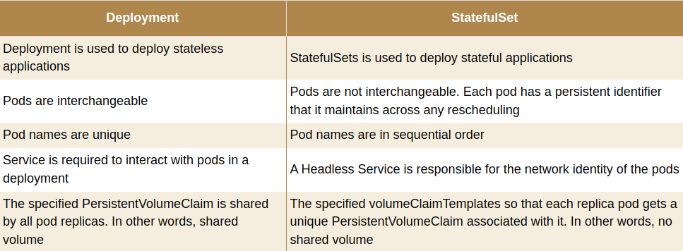
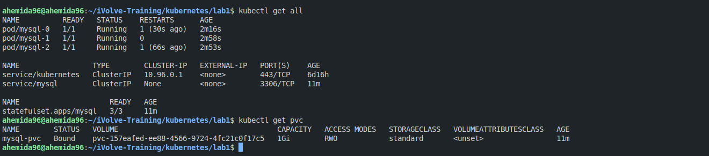

# Lab 27: Deployment vs. StatefulSet

This lab focuses on understanding the differences between Kubernetes Deployments and StatefulSets, and how to configure a MySQL StatefulSet with a corresponding service and persistent volume claim.

## Prerequisites
- Kubernetes cluster setup
- `kubectl` installed and configured

## Steps

### 1. Comparison between Deployment and StatefulSet

**Deployment**:
- Suitable for stateless applications.
- Pods are interchangeable and can be replaced without concern for identity or order.
- Typically used for web servers, APIs, and other stateless services.

**StatefulSet**:
- Suitable for stateful applications that require stable network identities and persistent storage.
- Pods are created in a sequential order and have unique, stable network identities.
- Typically used for databases, message queues, and other stateful services.



### 2. Create a YAML File for a MySQL StatefulSet Configuration with 3 Replicas

Create a StatefulSet for MySQL using the provided `statefulset.yaml` file.

```yaml
apiVersion: apps/v1
kind: StatefulSet
metadata:
  name: mysql
spec:
  selector:
    matchLabels:
      app: mysql
  serviceName: mysql
  replicas: 3
  template:
    metadata:
      labels:
        app: mysql
    spec:
      containers:
      - name: mysql
        image: mysql
        env:
        - name: MYSQL_ROOT_PASSWORD
          value: password
        ports:
        - containerPort: 3306
          name: mysql
        volumeMounts:
        - name: mysql-persistent-storage
          mountPath: /var/lib/mysql
      volumes:
      - name: mysql-persistent-storage
        persistentVolumeClaim:
          claimName: mysql-pvc
```

Apply the StatefulSet configuration:

```bash
kubectl apply -f statefulset.yaml
```

### 3. Write a YAML File to Define a Service for the MySQL StatefulSet

Create a service for the MySQL StatefulSet using the provided `service.yaml` file.

```yaml
apiVersion: v1
kind: Service
metadata:
  name: mysql
spec:
  selector:
    app: mysql
  clusterIP: None
  ports:
    - protocol: TCP
      port: 3306
```

Apply the service configuration:

```bash
kubectl apply -f service.yaml
```

### 4. Create a Persistent Volume Claim (PVC)

Create a Persistent Volume Claim for the MySQL StatefulSet using the provided `pvc.yaml` file.

```yaml
apiVersion: v1
kind: PersistentVolumeClaim
metadata:
  name: mysql-pvc
spec:
  accessModes:
    - ReadWriteOnce
  resources:
    requests:
      storage: 1Gi
```

Apply the PVC configuration:

```bash
kubectl apply -f pvc.yaml
```



## Explanation

- **StatefulSet**: The `statefulset.yaml` file defines a StatefulSet for MySQL with 3 replicas. Each pod will have a stable network identity and persistent storage.
- **Service**: The `service.yaml` file defines a headless service for the MySQL StatefulSet, which allows direct access to each pod.
- **Persistent Volume Claim (PVC)**: The `pvc.yaml` file defines a PVC that provides persistent storage for the MySQL pods.