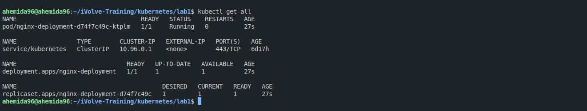
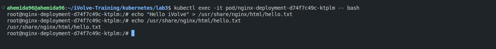
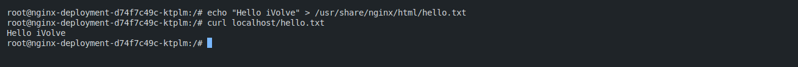
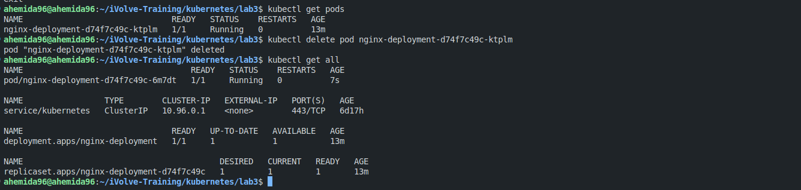
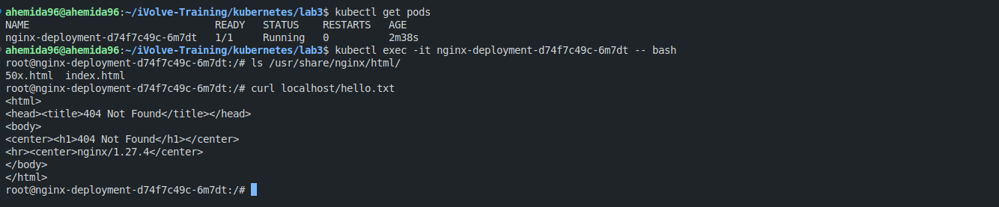
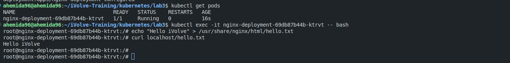
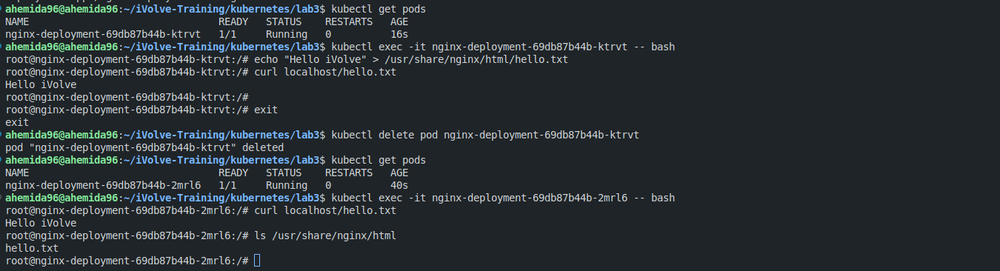
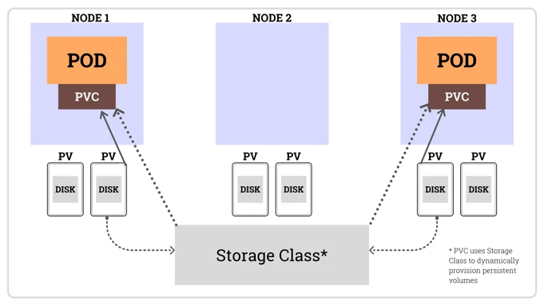

# Lab 28: Storage Configuration

This lab focuses on configuring storage in Kubernetes using Persistent Volumes (PV), Persistent Volume Claims (PVC), and StorageClasses. You will create an NGINX deployment, use a PVC to persist data across pod deletions, and compare different storage resources.

---

## Prerequisites
- Kubernetes cluster setup
- `kubectl` installed and configured

---

## Steps

### 1. Create an NGINX Deployment with 1 Replica

Create an NGINX deployment with 1 replica using the following YAML:

```yaml
apiVersion: apps/v1
kind: Deployment
metadata:
  name: nginx-deployment
spec:
  replicas: 1
  selector:
    matchLabels:
      app: nginx
  template:
    metadata:
      labels:
        app: nginx
    spec:
      containers:
      - name: nginx
        image: nginx
        ports:
        - containerPort: 80
        resources:
          requests:
            memory: "64Mi"
            cpu: "250m"
          limits:
            memory: "128Mi"
            cpu: "500m"
```
Note: Don't forget to add resources limit so that the other processes don't starve

Apply the deployment:

```bash
kubectl apply -f deployment.yaml
```

Verify the the deployed pod is runnig:
```bash
kubectl get all
```


---

### 2. Create a File in the NGINX Pod

1. **Exec into the Pod**:
   Get the pod name and exec into it:

   ```bash
   kubectl get pods
   kubectl exec -it <pod-name> -- /bin/bash
   ```

2. **Create a File**:
   Create a file at `/usr/share/nginx/html/hello.txt` with the content "hello iVolve":

   ```bash
   echo "Hello iVolve" > /usr/share/nginx/html/hello.txt
   ```
    

3. **Verify the File**:
   Exit the pod and use `curl` to verify the file is served:

   ```bash
   kubectl port-forward <pod-name> 8080:80
   curl localhost:8080/hello.txt
   ```
    

---

### 3. Delete the Pod and Verify File Persistence

1. **Delete the Pod**:
   Delete the NGINX pod and wait for the deployment to create a new one:

   ```bash
   kubectl delete pod <pod-name>
   ```
    

2. **Verify File Absence**:
   Exec into the new pod and check if the file `/usr/share/nginx/html/hello.txt` is still present. It should **not** be present since no persistent storage is configured yet.
    
---

### 4. Create a Persistent Volume Claim (PVC)

Create a PVC to provide persistent storage for the NGINX deployment:

```yaml
apiVersion: v1
kind: PersistentVolumeClaim
metadata:
  name: nginx-pvc
spec:
  accessModes:
    - ReadWriteOnce
  resources:
    requests:
      storage: 1Gi
```

Apply the PVC:

```bash
kubectl apply -f pvc.yaml
```

---

### 5. Modify the Deployment to Use the PVC

Update the NGINX deployment to attach the PVC to the pod at `/usr/share/nginx/html`:

```yaml
apiVersion: apps/v1
kind: Deployment
metadata:
  name: nginx-deployment
spec:
  replicas: 1
  selector:
    matchLabels:
      app: nginx
  template:
    metadata:
      labels:
        app: nginx
    spec:
      containers:
      - name: nginx
        image: nginx
        ports:
        - containerPort: 80
        resources:
          requests:
            memory: "64Mi"
            cpu: "250m"
          limits:
            memory: "128Mi"
            cpu: "500m"
        volumeMounts:
        - name: nginx-storage
          mountPath: /usr/share/nginx/html
      volumes:
      - name: nginx-storage
        persistentVolumeClaim:
          claimName: nginx-pvc
```

Apply the updated deployment:

```bash
kubectl apply -f deployment.yaml
```

---

### 6. Repeat Steps and Verify File Persistence

1. **Create the File Again**:
   Exec into the new pod and recreate the file:

   ```bash
   echo "hello iVolve" > /usr/share/nginx/html/hello.txt
   ```
    

2. **Delete the Pod**:
   Delete the pod and wait for a new one to be created:

   ```bash
   kubectl delete pod <pod-name>
   ```

3. **Verify File Persistence**:
   Exec into the new pod and verify that the file `/usr/share/nginx/html/hello.txt` is still present. It should persist because the PVC is now attached.

    

---

### 7. Comparison Between PV, PVC, and StorageClass


- **Persistent Volume (PV)**:
  - A piece of storage in the cluster provisioned by an administrator or dynamically using a StorageClass.
  - Represents physical storage resources.
  - Example:
    ```yaml
    apiVersion: v1
    kind: PersistentVolume
    metadata:
    name: local-device-pv
    spec:
    capacity:
        storage: 5Gi
    accessModes:
        - ReadWriteOnce
    hostPath: 
        path: /data/local-device-dir
    ```

- **Persistent Volume Claim (PVC)**:
  - A request for storage by a user. It binds to a PV and provides a way for pods to access storage.
  - Example:
    ```yaml
    apiVersion: v1
    kind: PersistentVolumeClaim
    metadata:
    name: local-device-pvc
    spec:
    storageClassName: local-device
    accessModes:
        - ReadWriteOnce
    resources:
        requests:
        storage: 5Gi
    ```

- **StorageClass**:
  - Defines a class of storage (e.g., SSD, HDD) and allows dynamic provisioning of PVs based on PVCs.
  - Example:
    ```yaml
    apiVersion: storage.k8s.io/v1
    kind: StorageClass
    metadata:
    name: local-device
    annotations:
        openebs.io/cas-type: local
        cas.openebs.io/config: |
        - name: StorageType
            value: device
        - name: FSType
            value: xfs
    provisioner: openebs.io/local
    reclaimPolicy: Delete
    volumeBindingMode: WaitForFirstConsumer
    ```